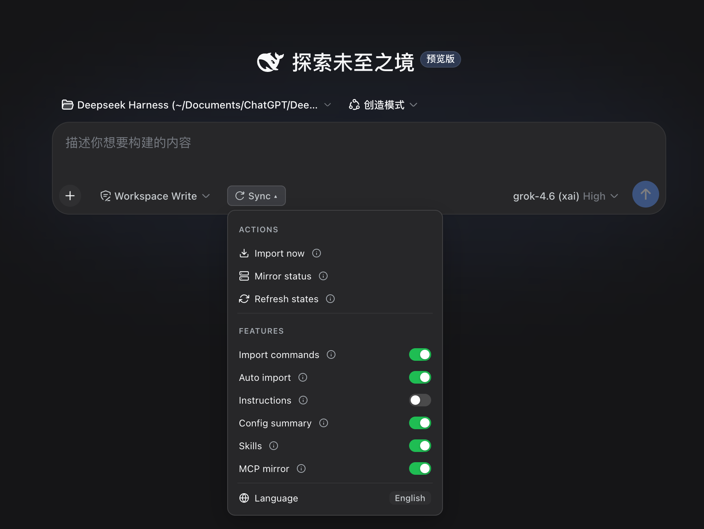

<div align="center">

# ⚡ dsh-codex-sync

**Seamless Bidirectional Sync between OpenAI Codex & DeepSeek Harness (DSH)**

<p align="center">
  <a href="README.md"><b>English</b></a> •
  <a href="README.zh-CN.md"><b>简体中文</b></a>
</p>

[](https://www.npmjs.com/package/dsh-codex-sync)
[](https://www.npmjs.com/package/dsh-codex-sync)
[](https://github.com/Walvez/dsh-codex-sync/actions)
[](package.json)
[](LICENSE)
[](https://awesome-dsh-plugin.com/p/Walvez/dsh-codex-sync/)

Sync skills, prompt instructions, config summaries, session history, and MCP servers directly into DSH. Provide Codex with a reverse MCP bridge to manage DSH plugins with 15+ dedicated tools.

<p align="center">
  
</p>
<p align="center">
  
</p>

</div>

---

## 🚀 Key Capabilities

- **✨ Live Skills Bridge**: Registers `~/.codex/skills/*/SKILL.md` as first-class DSH skills — edit a file, the next catalog scan picks it up. No copy, no drift. Full SKILL.md bodies and directory resource bases. Ships a **`codex-sync` skill** so the agent can dry-run imports, toggle settings, and check MCP status for you.
- **⚡ Live Instructions & Config Injection**: Reads `~/.codex/instructions.md` (or `AGENTS.md`) and `config.toml` dynamically—changes take effect on the next prompt assembly without restart.
- **💬 Smart Session History Importer**: **Import now** opens a picker grouped by project — search titles, hide sub-agents, grey-check already imported, re-import chats Codex continued. Also `/import-codex --dry-run`.
- **🔌 Bidirectional MCP Ecosystem**: 
  - **Codex → DSH**: Auto-mirrors `[mcp_servers.*]` from `config.toml` with live file watching.
  - **DSH → Codex**: Wires `[mcp_servers.dsh-plugins]` so Codex can discover, inspect, and install DSH plugins.
- **🎛️ In-Composer GUI Settings Panel**: Dedicated **Sync ▾** dropdown menu to run imports, check server status, and toggle any feature live with instant hover tooltips (ⓘ).

---

## 📦 Quick Start

### 1. DSH Setup

Install via DSH Market (recommended):
```bash
dsh plugin --profile web add dsh-codex-sync
```

Or mount via `cordis.patch.yml`:
```yaml
- insert:
    - id: codex-sync
      name: dsh-codex-sync
      config:
        maxSkills: 30
        mcpMirrorDeny:
          - node_repl
        mcpMirrorSilent:
          - exa
```

### 2. Codex Setup (Reverse MCP Bridge)

```bash
# Configure [mcp_servers.dsh-plugins] into ~/.codex/config.toml
npx dsh-codex-sync codex-install

# Check synchronization health
dsh-codex-sync doctor
```

---

## 🎛️ In-Composer GUI Settings

Click **Sync ▾** in the composer row to access the control panel. Badges reflect live host configuration, and every feature switch can be toggled without editing configuration files.

| Group | Item | Action / Key | Behavior |
|---|---|---|---|
| **Actions** | Import now | `/import-all` | Run incremental history import |
| | Mirror status | `/mcp-status` | Display per-server mirror health & diagnostics |
| | Refresh states | `/codex-settings` | Re-read all switches from host |
| **Features** | Import commands | `enableImport` | Enable `/import-codex` command family |
| | Auto import | `autoImport` | Import new sessions on startup |
| | Instructions | `enableInstructions` | Inject `instructions.md` / `AGENTS.md` into prompt |
| | Config summary | `enableConfig` | Inject `config.toml` model summary into prompt |
| | Skills | `enableSkills` | Register `~/.codex/skills` as DSH skills |
| | MCP mirror | `mcpMirror` | Auto-mirror `[mcp_servers.*]` to DSH |
| **Language** | English ⇄ 中文 | `Language` | Switch GUI language (persisted in localStorage) |

> 💡 *Hover over the **ⓘ** icon next to any item to view its detailed description.*

---

## ⚡ Slash Commands Reference

| Command | Arguments | Description |
|---|---|---|
| `/import-codex` | `[--dry-run]` `[--limit N]` `[--project str]` `[--since date]` `[--include-subagents]` | Import Codex sessions (dry-run prints `[would-import]`, writes nothing) |
| `/import-all` | *(Same as above)* | Alias of `/import-codex` |
| `/attach-workspaces` | *None* | Re-attach all imported sessions to matching CWD workspaces |
| `/mcp-status` | *None* | Display real-time status and reasons for all MCP servers |
| `/auto-import` | `[on\|off]` | Toggle auto-import on startup (query without args) |
| `/codex-settings` | *None* | Print all feature switches and effective states |
| `/codex-setting` | `<key> [on\|off]` | Toggle specific sync features via command line |

---

## ⚙️ Configuration Reference

| Option | Default | Description |
|---|---|---|
| `codexHome` | `~/.codex` | Codex configuration directory |
| `enableSkills` | `true` | Register Codex skills as first-class DSH skills |
| `enableInstructions` | `true` | Inject `instructions.md` / `AGENTS.md` into prompt |
| `enableConfig` | `true` | Inject `config.toml` model summary into prompt |
| `enableImport` | `true` | Register `/import-codex` command family |
| `maxSkills` | `100` | Max number of skills to scan and register |
| `maxSessionBytes` | `268435456` *(256MB)* | Skip rollouts larger than this limit to prevent V8 string crashes |
| `importSubagents` | `false` | When `true`, imports sub-agent rollout threads (`parent_thread_id`) |
| `mcpMirror` | `true` | Auto-mirror `[mcp_servers.*]` from `config.toml` |
| `mcpMirrorDeny` | `[]` | Blacklist of server names never to mirror (`dsh-plugins` excluded) |
| `mcpMirrorOnly` | *None* | Whitelist: if set, mirrors **only** these specified server names |
| `mcpMirrorSilent` | `[]` | Stdio servers started with `2>/dev/null` to silence chatty stderr logs |
| `autoImport` | `false` | Run incremental import automatically on startup session |

---

## 🧪 Testing

```bash
npm test
```

The test suite runs hermetic cases (host lifecycle, client SSR, rollout reader, import dry-run / sub-agent filter, state persistence) without a global DSH install. CI also boots a scratch DSH profile to prove the plugin mounts.

See [CONTRIBUTING.md](CONTRIBUTING.md) if you want to send a patch.

---

## 📋 What syncs

See **[docs/compat.md](docs/compat.md)** for the full matrix: skills, instructions, MCP, sessions, and sub-agent handling.

Preview an import:

```bash
# in a DSH session
/import-codex --dry-run
```

---

## 🔒 Security

Please report vulnerabilities privately — see [SECURITY.md](SECURITY.md). Do not file public issues for security reports.

---

## 📜 License

[MIT License](LICENSE) © 2026 Walvez.
