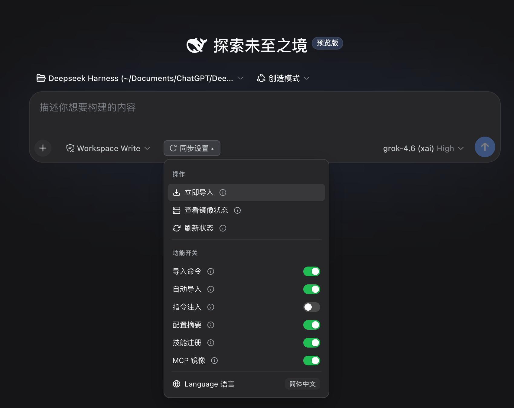
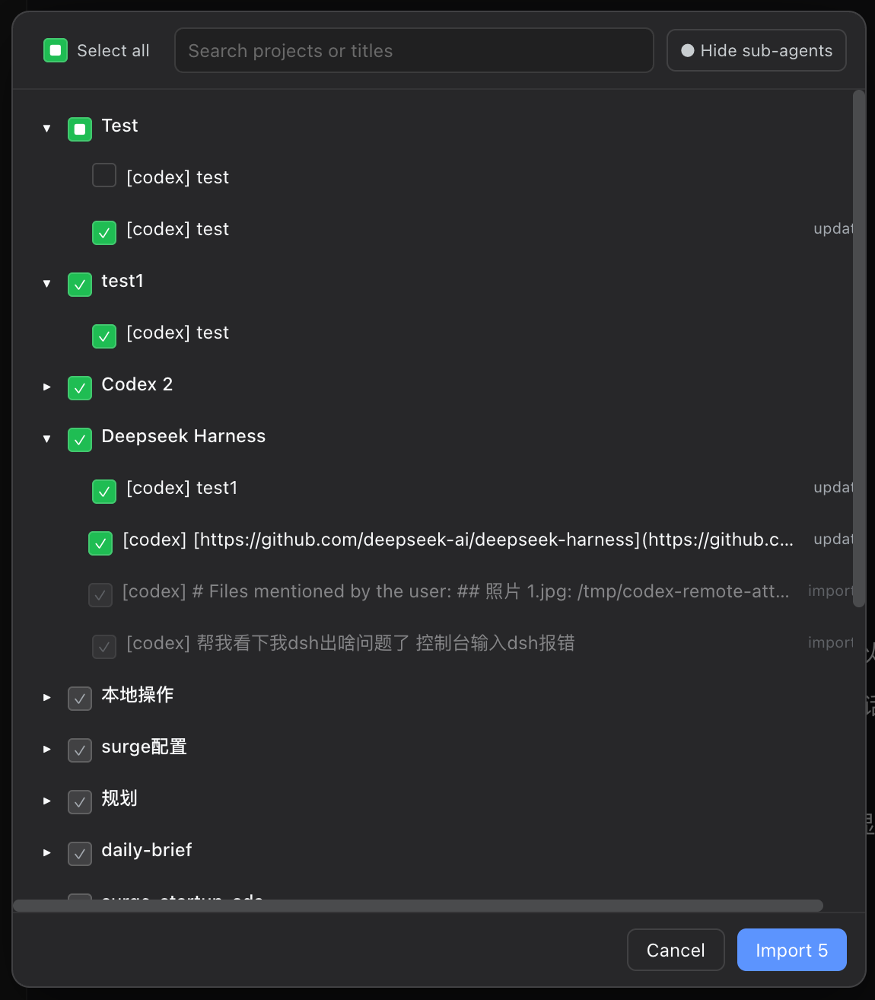

<div align="center">

# ⚡ dsh-codex-sync

**Codex 一键搬家到 DSH：Codex 项目对话自动导入 DSH，Skills、MCP 双向同步。**

<p align="center">
  <a href="README.md"><b>English</b></a> •
  <a href="README.zh-CN.md"><b>简体中文</b></a>
</p>

[](https://www.npmjs.com/package/dsh-codex-sync)
[](https://www.npmjs.com/package/dsh-codex-sync)
[](https://github.com/Walvez/dsh-codex-sync/actions)
[](package.json)
[](LICENSE)
[](https://awesome-dsh-plugin.com/p/Walvez/dsh-codex-sync/)

<br/>

<table>
  <tr>
    <td align="center" width="55%">
      <b>🎛️ Composer 同步控制面板</b><br/>
      
    </td>
    <td align="center" width="45%">
      <b>💬 智能项目导入对话框</b><br/>
      
    </td>
  </tr>
</table>

</div>

---

## 🚀 核心特性

- **✨ 技能实时挂载**：`~/.codex/skills/*/SKILL.md` 直接注册为 DSH 原生 Skills——改文件，下次目录扫描即生效。不用拷贝、不会漂移。
- **🤖 插件内置 `codex-sync` 智能体技能**：自带 Agent Skill，可直接让 DSH Agent 为你执行导入预演、修改开关或排查 MCP 镜像状态。
- **💬 智能历史会话导入**：点击 **立即导入** 即可呼出项目树对话框，支持即时搜索、子代理嵌套折叠、已导入灰勾标记，以及续聊对话增量追加。
- **🔌 双向 MCP 互联互通**：
  - **Codex → DSH**：自动监听并镜像 `config.toml` 中的 `[mcp_servers.*]`。
  - **DSH → Codex**：自动配置 `[mcp_servers.dsh-plugins]` 反向桥，让 Codex 可搜索、检查与安装 DSH 插件。
- **🌓 原生深浅色主题适配**：严格遵从 DSH 设计系统令牌（`--dsw-alias-*`），配备矢量图标、顺滑 iOS 风格滑块与实时悬浮说明（ⓘ）。

---

## 📦 快速开始

### 1. DSH 端配置

推荐通过 DSH 插件市场一键安装：
```bash
dsh plugin --profile web add dsh-codex-sync
```

或在 `cordis.patch.yml` 中添加 Insert 行挂载：
```yaml
- insert:
    - id: codex-sync
      name: dsh-codex-sync
      config:
        maxSkills: 30
        mcpMirrorDeny:
          - node_repl
        mcpMirrorSilent:
          - exa
```

### 2. Codex 端配置（反向 MCP 桥）

```bash
# 自动配置 [mcp_servers.dsh-plugins] 进 ~/.codex/config.toml
npx dsh-codex-sync codex-install

# 运行同步健康体检
dsh-codex-sync doctor
```

---

## 🎛️ Composer 界面设置

点击输入框左侧的 **同步设置 ▾** 按钮即可打开控制面板。所有开关状态均读取宿主真实配置，点击可直接切换并持久化保存。

| 分组 | 项目 | 对应命令 / 配置键 | 行为说明 |
|---|---|---|---|
| **操作** | 立即导入 | `/import-all` | 打开项目选择对话框并导入对话 |
| | 查看镜像状态 | `/mcp-status` | 查看每个 MCP 服务器的镜像状态与诊断原因 |
| | 刷新状态 | `/codex-settings` | 重新从宿主读取所有开关的真实值 |
| **功能开关** | 导入命令 | `enableImport` | 启用 `/import-codex` 等导入命令 |
| | 自动导入 | `autoImport` | 启动首个会话时自动增量导入 |
| | 指令注入 | `enableInstructions` | 注入 `instructions.md` / `AGENTS.md` 进提示词 |
| | 配置摘要 | `enableConfig` | 注入 `config.toml` 模型摘要进提示词 |
| | 技能注册 | `enableSkills` | 将 `~/.codex/skills` 注册为 DSH 技能 |
| | MCP 镜像 | `mcpMirror` | 自动镜像 `[mcp_servers.*]` 到 DSH |
| **语言** | English ⇄ 中文 | `Language` | 切换界面中英文（localStorage 持久化） |

> 💡 *鼠标悬浮在任意项目右侧的 **ⓘ** 图标上即可查看对应说明浮窗。*

---

## ⚡ Slash 指令参考

| 指令 | 参数 | 说明 |
|---|---|---|
| `/import-codex` | `[--dry-run]` `[--ids a,b]` `[--limit N]` `[--project 子串]` `[--since 时间]` `[--include-subagents]` | 导入 Codex 会话（`--dry-run` 只打印 `[would-import]`，不写盘） |
| `/import-all` | *(同上)* | `/import-codex` 的别名 |
| `/attach-workspaces` | *无* | 补挂所有导入会话到对应的 CWD 工作区 |
| `/mcp-status` | *无* | 查看所有 MCP 镜像服务器的实时状态与原因 |
| `/auto-import` | `[on\|off]` | 切换启动时自动导入（无参数时查询状态） |
| `/codex-settings` | *无* | 打印所有功能开关的机器可读清单 |
| `/codex-setting` | `<key> [on\|off]` | 通过命令行切换指定的同步功能 |

---

## ⚙️ 配置项说明

| 配置项 | 默认值 | 说明 |
|---|---|---|
| `codexHome` | `~/.codex` | Codex 配置根目录 |
| `enableSkills` | `true` | 注册 Codex 技能为 DSH 原生技能 |
| `enableInstructions` | `true` | 注入 `instructions.md` / `AGENTS.md` 进系统提示词 |
| `enableConfig` | `true` | 注入 `config.toml` 模型摘要进系统提示词 |
| `enableImport` | `true` | 注册 `/import-codex` 系列命令 |
| `maxSkills` | `100` | 最大扫描与注册的技能数量 |
| `maxSessionBytes` | `268435456` *(256MB)* | 规避 Node V8 字符串上限的超大 rollout 保护阈值 |
| `importSubagents` | `false` | 为 `true` 时连同子代理线程（`parent_thread_id`）一起导入 |
| `mcpMirror` | `true` | 自动镜像 `config.toml` 中的 `[mcp_servers.*]` |
| `mcpMirrorDeny` | `[]` | 镜像黑名单列表（`dsh-plugins` 恒排除） |
| `mcpMirrorOnly` | *未设置* | 镜像白名单：若设置则仅镜像指定名称的服务器 |
| `mcpMirrorSilent` | `[]` | 静音列表：以 `2>/dev/null` 启动对应 stdio 服务屏蔽冗余日志 |
| `autoImport` | `false` | 启动首个会话时自动增量导入 |

---

## 📋 兼容性对照

完整对照表请参阅 **[docs/compat.md](docs/compat.md)**（技能、指令、MCP、会话与增量更新机制）。

---

## 🧪 测试验证

```bash
npm test
```

封闭测试覆盖宿主生命周期、客户端 SSR、rollout 解析、增量更新、子代理过滤以及持久化开关，无需全局安装 DSH 即可直接运行。

---

## 📜 开源协议

[MIT License](LICENSE) © 2026 Walvez.
