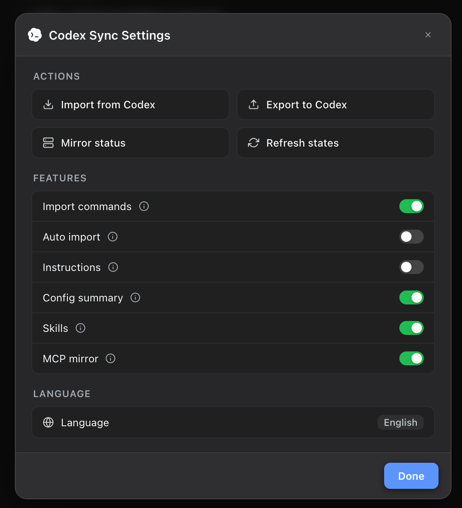
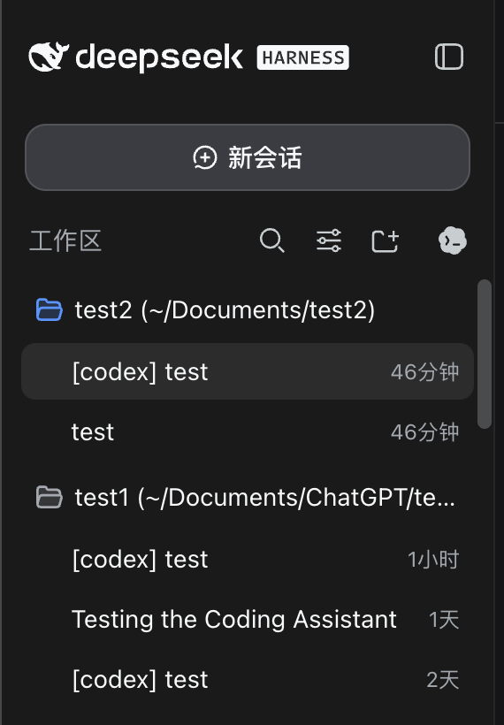
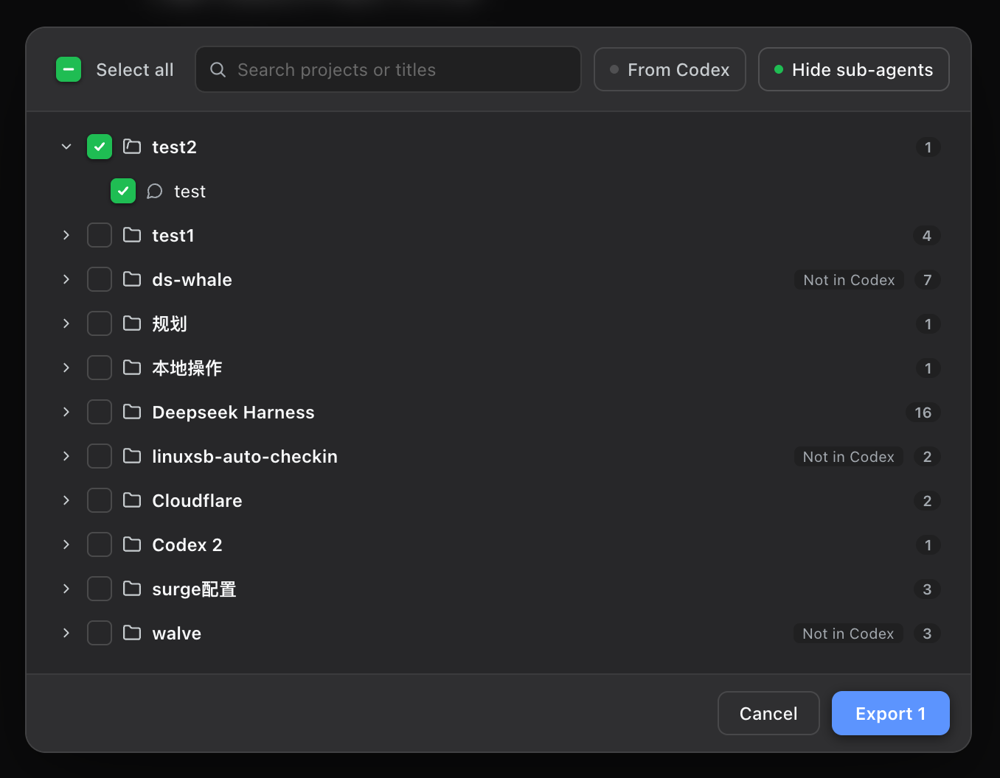

<div align="center">

# ⚡ dsh-codex-sync

**OpenAI Codex 与 DSH 终极双向同步桥：项目对话双向互导续聊，Skills 实时挂载、MCP 自动双向镜像。**<br/>
*项目会话双向流转 · 技能实时挂载 · MCP 自动镜像 · 原生现代化交互*

<p align="center">
  <a href="README.md"><b>English</b></a> •
  <a href="README.zh-CN.md"><b>简体中文</b></a>
</p>

[](https://www.npmjs.com/package/dsh-codex-sync)
[](https://www.npmjs.com/package/dsh-codex-sync)
[](https://github.com/Walvez/dsh-codex-sync/actions)
[](package.json)
[](LICENSE)
[](https://awesome-dsh-plugin.com/p/Walvez/dsh-codex-sync/)

<br/>

<table>
  <tr>
    <td align="center" width="50%">
      <b>🎛️ 侧边栏原生同步设置</b><br/>
      
    </td>
    <td align="center" width="50%">
      <b>📍 顶部工作区快捷入口</b><br/>
      
    </td>
  </tr>
  <tr>
    <td align="center" width="50%">
      <b>📥 从 Codex 导入项目对话</b><br/>
      
    </td>
    <td align="center" width="50%">
      <b>📤 导出 DSH 对话到 Codex</b><br/>
      
    </td>
  </tr>
</table>

</div>

---

## 🤔 为什么要用这个插件？

在使用 OpenAI Codex 时，你可能已经积累了：
1. **大量项目的对话历史**（包含完整的代码上下文、架构讨论与调试记录）；
2. **丰富的自定义 Skills 库**（`~/.codex/skills` 下各种专有工具与指令）；
3. **精心配置的 MCP 服务工具链**（数据库、搜索、浏览器自动化等）。

当你想在 **DeepSeek Harness (DSH)** 中体验强大的开源模型生态或开展双 Agent 协作时，通常会遇到：
- **历史无法迁移**：两边会话格式互不相通，想在 DSH 中接续之前的 Codex 对话极其繁琐；
- **配置割裂与漂移**：Skills 和 MCP 必须在两边重复配置维护，改了一边另一边就失效；
- **单向死胡同**：市面上的迁移脚本往往只是一次性的、粗暴的单向文件拷贝，在 DSH 续聊后无法安全带回 Codex。

**`dsh-codex-sync` 正是为解决这些痛点而生！** 它不是一次性迁移脚本，而是让 Codex 与 DSH **持续互联互通、双向无缝流转** 的现代化扩展。

---

## ✨ 核心方便之处

### 1. 💬 项目会话双向安全互导（Codex ⇄ DSH）
- **从 Codex 导入**：
  - 按项目（Workspace）树状聚合所有历史对话；
  - 完整保留用户消息、助手回复、思维链推理（Reasoning）与工具调用轨迹；
  - 导入后自动关联对应工作区，在 DSH 中**直接断点续聊**；
  - 支持增量更新：Codex 续聊过的旧对话会标记「有更新」，再次勾选仅增量追加新 Turn，不重复创建会话。
- **导出到 Codex**：
  - 在 DSH 续聊的内容或新建的原生会话，可一键导出回 Codex；
  - 自动校验 Codex 已有项目库，智能锁定未知目录，杜绝孤儿会话；
  - 导出生成独立的全新 Codex 会话副本（`history_mode: legacy`），**绝不破坏或覆盖原 Codex 历史**；
  - 导出完成后重启 Codex 即可在对应项目下查看并继续工作。
- **子代理智能收纳**：
  - 默认过滤子代理线程，保持列表干净清爽；
  - 点击「过滤子代理」可随时展开并嵌套在主会话下方，按需单独导出，不污染父会话。

### 2. ⚡ Skills 实时一等公民挂载
- 直接将 `~/.codex/skills/*/SKILL.md` 注册为 DSH 原生一等公民技能；
- 支持完整的子目录资源引用与多文件架构；
- **改完即用**：在本地修改 `SKILL.md`，DSH 下次调用即时生效，无需重启 DSH 服务。

### 3. 🔌 MCP 自动双向镜像
- **Codex → DSH**：后台自动监听 `~/.codex/config.toml`，将 `[mcp_servers.*]` 动态镜像到 DSH，支持热重载，并内置常用服务的静音与冲突排除策略；
- **DSH → Codex（反向桥）**：一行命令配置 `[mcp_servers.dsh-plugins]`，让 Codex Agent 也具备搜索、检查与安装 DSH 插件的能力。

### 4. 🎨 极度优雅的原生现代化 UI
- **专属入口**：自适应融入工作区标题栏（展开时位于工作区标题旁，收起窄栏时整齐排列在搜索图标下方）；
- **居中模态卡片**：点击呼出高对比度毛玻璃控制面板，快捷操作、状态卡片、功能开关一目了然；
- **原生设计语言**：采用 iOS 风格平滑切换滑块与纯 CSS 过渡，自适应 DSH 深浅色主题，零样式残留与无横向溢出。

---

## 📦 快速开始

### 1. 安装到 DSH

通过 DSH 插件市场一键安装（推荐）：
```bash
dsh plugin --profile web add dsh-codex-sync
```

或在 profile 的 `cordis.patch.yml` 中配置：
```yaml
- insert:
    - id: codex-sync
      name: dsh-codex-sync
      config:
        maxSkills: 30
        mcpMirrorDeny:
          - node_repl
        mcpMirrorSilent:
          - exa
```

### 2. 配置 Codex 反向 MCP 桥（可选）

```bash
# 自动在 ~/.codex/config.toml 挂载 [mcp_servers.dsh-plugins]
npx dsh-codex-sync codex-install

# 检查双向同步健康状态
dsh-codex-sync doctor
```

---

## 🎛️ 同步控制面板与开关

点击侧边栏工作区的 **Codex 图标** 即可打开居中设置面板：

| 分组 | 项目 | 对应命令 / 配置键 | 行为说明 |
|---|---|---|---|
| **操作** | 从 Codex 导入 | `/import-all` | 打开项目选择对话框，按项目勾选导入历史对话 |
| | 导出到 Codex | `/export-codex` | 将 DSH 会话写出为全新 Codex 对话副本 |
| | 查看镜像状态 | `/mcp-status` | 弹窗查看每个 MCP 服务器的挂载状态与诊断信息 |
| | 刷新状态 | `/codex-settings` | 实时重新拉取宿主机所有开关的真实值 |
| **功能开关** | 导入命令 | `enableImport` | 启用 `/import-codex` 等 slash 命令族 |
| | 自动导入 | `autoImport` | 启动首个会话时自动增量导入 Codex 历史 |
| | 指令注入 | `enableInstructions` | 注入 `instructions.md` / `AGENTS.md` 进系统提示词 |
| | 配置摘要 | `enableConfig` | 注入 `config.toml` 模型配置摘要进系统提示词 |
| | 技能注册 | `enableSkills` | 将 `~/.codex/skills` 挂载为 DSH 原生技能 |
| | MCP 镜像 | `mcpMirror` | 自动监听并镜像 `[mcp_servers.*]`（开关立即生效） |
| **语言** | 语言切换 | `Language` | 切换界面简体中文 / English（本地记住） |

---

## 🤖 智能体辅助技能 (`codex-sync`)

本插件随包提供了一个内建的 `codex-sync` Skill。你可以直接在对话中让 AI Agent 操作同步：

- *“帮我预演一下导入 Codex 会话”* → 自动执行 `/import-codex --dry-run`；
- *“查看当前的 MCP 镜像状态”* → 自动执行 `/mcp-status`；
- *“开启自动导入功能”* → 自动执行 `/auto-import on`。

---

## 📄 开源许可

[MIT License](LICENSE) © 2026 Walvez
